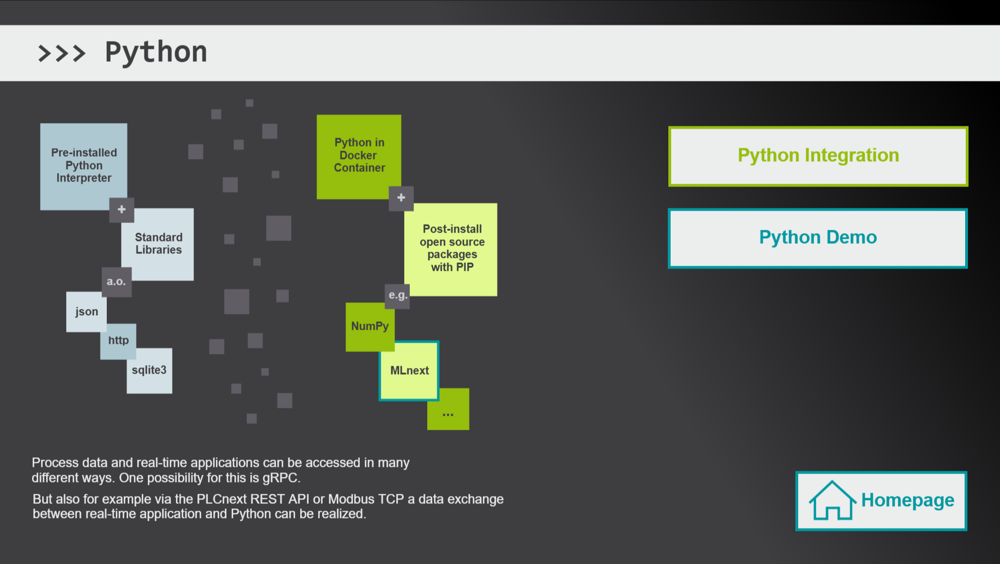
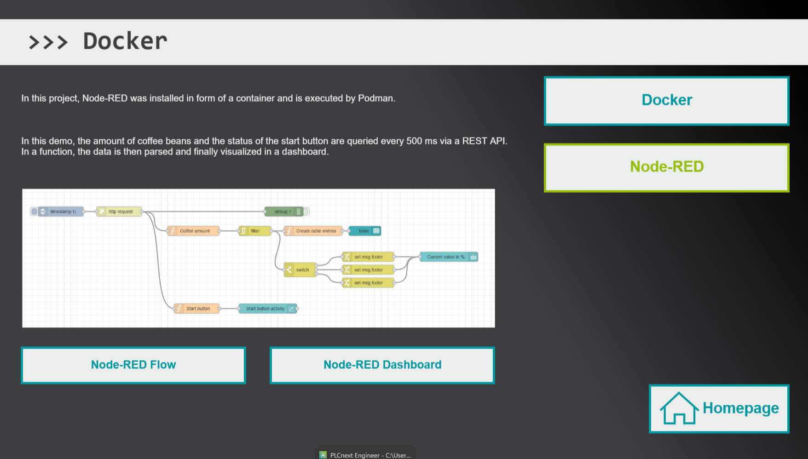
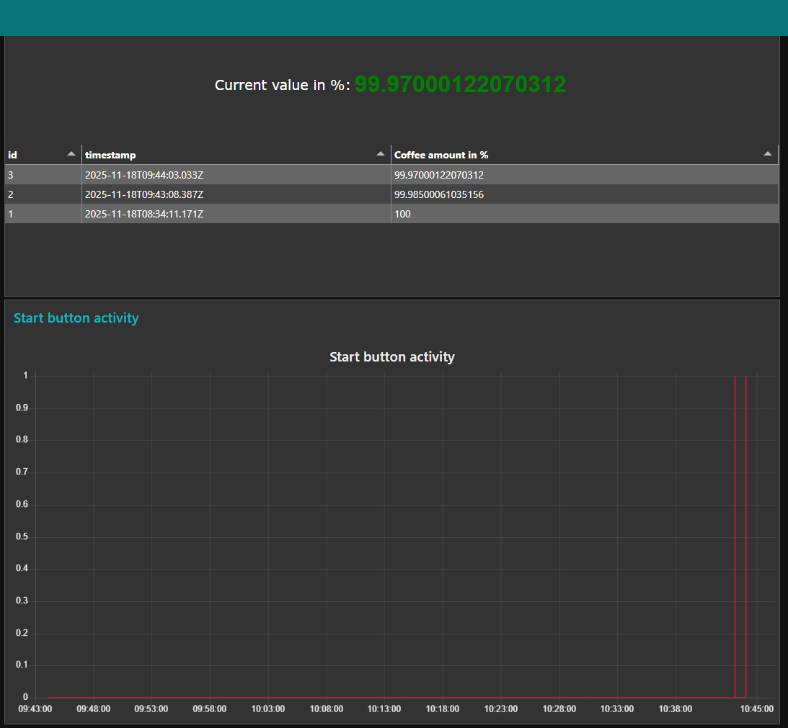
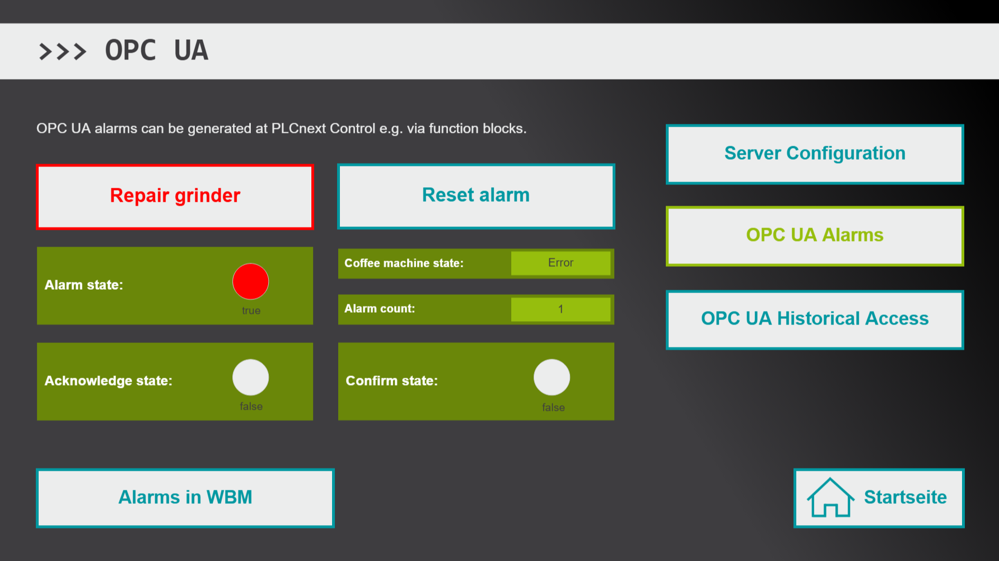

# CoffeeMachineDemo
In this repository you can find a demo project where different features of PLCnext Control are combined.

## Introduction

This demo application demonstrates the versatility and openness of the open control platform PLCnext Technology using the example of a coffee machine control.

Through a visualization provided via the integrated web server of PLCnext Control, you will receive explanations and can practically experience various programming options.

## Requirements

### Hardware
- Computer with Microsoft Windows operating system
- PLCnext Starter Kit with AXC F 2152 (article no.: 1188165)
- SD Flash with 8GB PLCnext Memory (1061701)

### Software

The following software must be installed on the PC:
- WinSCP
- HTML5 capable browser
- PLCnext Engineer version 2025.0 LTS or later
- PLCnext Control firmware version 2025.0 LTS or later

## Installation

Please prepare your PLCnext Control as follows:

### First steps:
1. Reset your PLC. For this, push the reset button during the boot process until RUN and FAIL LED light up.   DO NOT PRESS THE RESET BUTTON FOR MORE THAN 20 SECONDS.
2. Download the PLCnext Engineer demo project from this repository. You can open it with PLCnext Engineer 2025.0 LTS.
3. Adjust the network settings if required.
4. Write/send the demo project to the AXC F 2152.

### For Node-RED and Python:
1. Configure the network settings of your PLC to enable Internet access. This may require adjusting the IP address and default gateway. To verify connectivity, you can send a ping to a well-known website via SSH.
2. Now create a WinSCP session.
3. Copy the following files to **/opt/plcnext** (on your PLC):
    - **myscript.py**
    - **myscript.service**
    - **setup.sh**
4. Start a PuTTy session and run these commands:  
   `sudo passwd root` <- Creates a new root user (Enter the admin password first, then define a password for your root user)  
   `su` <- Changes to root (Enter the root password when prompted  
   `chmod 775 setup.sh` <- Changes the permissions to allow execution  
   `./setup.sh` <- Runs the installation script  
5. Wait until the installation process is finish. This may take around 15-20 minutes.
6. Copy the **flows.json** from this repo file to **/opt/plcnext/node_red_user_data**
7. Open Node-RED by entering this URL in your browser: **http://<ip.of.your.plc>:1880**
8. Open the node configuration of the http request node and change the IP address within the URL.
9. Deploy your changes.
10. Restart your PLCnext Control. When the RUN LED is green, your PLC is ready and you can open the visualization in the web browser by entering the PLC's IP address as URL.

## Project content

Here some more information about this demo project:

### Start page

In the upper left area you can switch the language to English as needed.
All elements will then be translated. 

Below that, you have 12 tiles on different topics to choose from. By clicking on a tile you will get more information about the respective topic and you can experience the functionality on PLCnext Control by means of the demo application of a coffee machine. 

<b> Please note: </b> This is only a selection of some possibilities that can be used with PLCnext Control.
  
### Project

Via the first tile you get a short overview of the demo project of a coffee machine.  
  
The round info buttons allow you to call up additional information.

 
You can also operate the coffee machine here and make virtual coffee. 

For this, select directly in the visualization whether you want to fill a cup or a mug. You can use the slider on the PLCnext Starter Kit to define the intensity of the coffee.
Your setting is displayed in the visualization within the control panel. 

Finally, you can start the process using the first button on the Starter Kit board.
The panel shows the status of the coffee machine. After completion, the coffee machine returns to its initial state and you can order another coffee.

### Web-based Management

This tile brings you directly to the Web-based Management, which offers a wide variety of configurations and provides diagnostic information.

### PLCnext Community

Here you can see a screenshot of the PLCnext Community page as well as blocks with keywords for content that can be found within the PLCnext Community.
  
If your computer has Internet connection, you can also open the PLCnext Community directly via the button "www.plcnext-community.net".

### PLCnext Store

Via this tile you can get a first overview of the PLCnext Store by means of the image and key points.  
  
In addition, it is possible to see which apps are installed on the PLC. This is possible by clicking on "Apps on this PLC". By default, this demo project uses no app.
  
If your computer has Internet connection, then you can open the PLCnext Store by clicking on "www.plcnextstore.com". 

### IEC 61131

One part of the demo project was realized in the programming languages of IEC 61131 standard. 

- To first get an overview of the software used for this, you will find general information about the engineering software in the preselected area "PLCnext Engineer".
- Via the button "IEC 61131 Editors" a general overview of the available editors in PLCnext Engineer is given. 
- Finally, you can also try out IEC 61131 programming in a demonstration. It is used to control the fill level depending on the cup size and to determine the machine status. Via "Panel" you can open the operating panel of the coffee machine and change the preselection from "Mug" to "Cup". Then close the panel window and press the start button on the Starter Kit (first button). In the green fields you can now see the status of the coffee machine and how much coffee has been output.

### C++

The control of the grinder depending on the selected coffee strength has been programmed in C++. 

In the screenshot you can see that Eclipse was used for this. However, the PLCnCLI tool provided by Phoenix Contact allows programming in any C++ editor or even in a simple text editor. 

The use of Eclipse or Visual Studio offers the advantage that plug-ins are provided free of charge for these softwares, which allow an interface-based operation, i.e. menu options for PLCnext. 

When compiling the project, a PLCnext Engineer library is created, which contains the C++ program(s). This library can then be transferred to the PLCnext Engineer project. Finally, the C++ program must be instantiated and any ports provided can be linked, for example to enable process data access.

Some examples of C++ projects for PLCnext Control can be found on GitHub. If you click on the Block with the GitHub icon you can directly open the C++ examples provided there. 

In the "C++ Demo" area you can test the programming related to the coffee machine project.  
To do this, simply start the machine via the start switch on the PLCnext Starter Kit (first switch). In the green fields you can read information about the grinding process. Depending on how you set the intensity via the slider, the grinding process will take longer or less time.

### Matlab Simulink

Matlab Simulink models can be compiled to PLCnext Engineer libraries using the "PLCnext Target for Simulink". This was done here for the simulation of the filling process.

There are two further sections here. In "Debugging in Matlab Simulink" it is shown how the online values can be examined directly in Matlab Simulink via External Mode. 
For this purpose, a "Scope" block has been added, which can be used to observe the temporal course of the coffee volume.

How debugging works without Matlab Simulink license is shown in the section "Debugging in PLCnext Engineer". Here, thanks to the PLCnext Engineer add-in, the Simulink model is displayed directly in the engineering project with online values. Ports can also be observed over time via the logic analysis.

### Python

In the section "Python Integration" you can find some general information and keywords about the usage of Python on PLCnext Control. 

In the demo project a the Python code is executed by the pre-installed Python interpreter. It is used to provide the log files including the database of the data logger (see sub-folder "datalogger") via HTTP port 51880.

The Python code can be downloaded and opened in any text editor. If you are interested, use the "Python Script" button for downloading.

### Docker

Here you will first get general information about using Docker on PLCnext Control.

An example is given to you in relation to Node-RED, which was installed on the PLC as a container running on Podman.

You can see a Node-RED sample application by clicking on the button "Node-RED". Node-RED is used in the project to read in the amount of coffee beans and to visualize this value in a dashboard.

The dashboard can be accessed via **http://<ip.of.your.plc>:1880/ui**

### Data logging

This section gives some general information about logging data. You will find a selection of possibilities that are available to you with the PLCnext Control, e.g. data can be logged internally, i.e. directly on the controller, or in external databases.

The "Real-time data logger" area allows you to view data logged in an SQLite database. For this, the data logger can be configured within the PLCnext Engineer project. An additional programming is not necessary. 
The SQLite database is then created and filled directly on the PLC. You can download the database from the PLC and open it, for example, using the "DB Browser for SQLite" software.

### OPC UA

On the subject of OPC UA, it is first shown which server configurations are possible. The picture on the left side is partly interactive. Thus you can display the different setting areas by clicking on the different menu options - just as it is possible in the PLCnext Engineer software. For a better overview, the selected area is additionally framed in red here.

In "OPC UA Alarms" you have the possibility to cause an alarm by blocking the grinder via mouse click. To do this, select the button "Block Grinder". You will then see that the alarm status changes to "true" and the coffee machine changes to the "Error" status.

Also with a mouse click, you can repair the grinder again. This causes the alarm status to be set to "false". However, since no error confirmation has yet taken place, the coffee machine will remain in the "Error" state until "Reset alarm" is selected.

The occurrence of an alarm can be observed via the test client software "UA Expert" or within the Web-based Management in "Diagnostics" > "Notifications".

Furthermore, it is possible to access historical data, if a variable is provided via OPC UA as well as processed by the data logger. 
If a client supports OPC UA Historical Access (HA), then it could make use of this function. The client shown here in the screenshot is the test client of Unified Automation "UA Expert".

### Cloud access

PLCnext Control can be connected to different cloud solutions, e.g. via MQTT. Some of these possibilities can be found here in the "Clouds" section.

One cloud solution that can be accessed directly thanks to an integrated cloud coupler and without additional programming is Proficloud.io from Phoenix Contact.
More information to Proficloud.io will be available by clicking the corresponding button. 

Here you can see some general information and which services are available for PLCnext Control.
If you click on the "Time Series Data Service" button, you will see a screenshot of a dashboard that displays the available amount of coffee beans. If a minimum level is reached, an alarm can be generated automatically, which informs you by mail that coffee beans should be refilled.

You can also try this yourself. For this purpose, your PLC requires a connection to the Internet. Make sure that security measures are taken to prevent unauthorized access to your PLC. To connect the AXC F 2152 to proficloud.io, the service must be enabled via Web-based Management. Furthermore, the PLC must be registered within the proficloud.io which can be done via UUID shown in the Web-based Management (but also printed on the PLC housing). Once the PLC is registered you can search for provided data. You will find here the amount of coffee beans which can be visualized in a dashboard.

## License

Copyright (c) Phoenix Contact GmbH & Co KG. All rights reserved.

Licensed under the [MIT](LICENSE) License.
